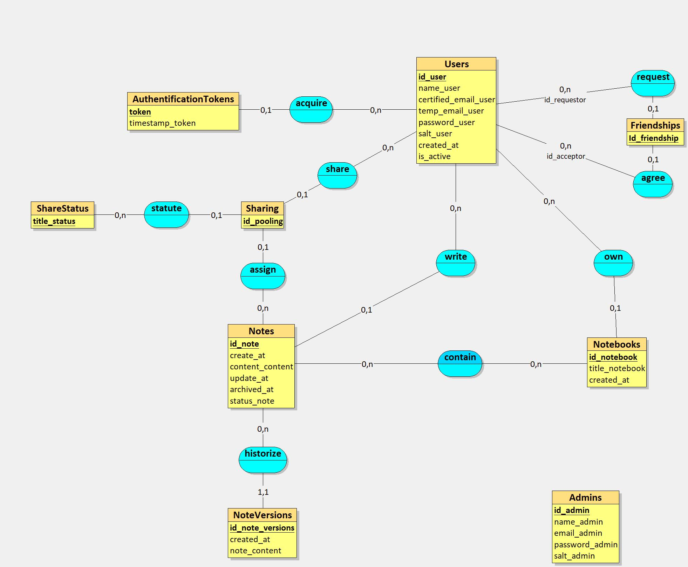

# Modèle Conceptuel des Données (MCD)

## Introduction

Le Modèle Conceptuel des Données est une représentation abstraite des structures de données d'un système d'information. Il identifie les entités, leurs attributs et les relations entre elles, sans se soucier des détails techniques. Le MCD sert de base pour la conception et la communication des exigences métier.

## Schéma

