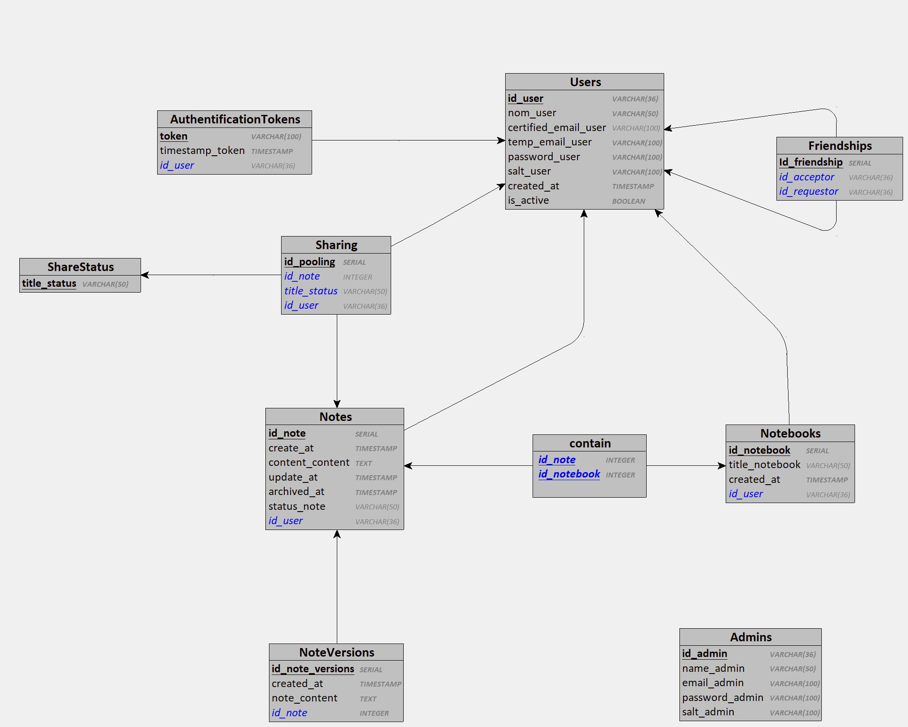

# Modèle Logique de Données (MLD)

## Introduction

Le Modèle Logique de Données (MLD) est une représentation détaillée des structures de données d'un système, décrivant les tables, colonnes, types de données et relations. Il traduit le Modèle Conceptuel des Données en un format adapté à la mise en œuvre dans une base de données, sans inclure de détails physiques.

## Schéma

